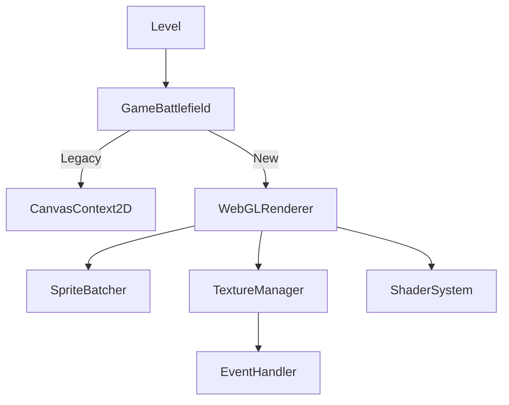

# WebGL 迁移设计方案

## 1. 现有架构分析 (Current Architecture Analysis)

### 1.1 渲染管线
当前渲染流程主要由 `Level.ts` 的主循环驱动，通过 `GameBattlefield.ts` 协调各层级的绘制。
- **主循环**: `Level.#frameLoop` 使用 `requestAnimationFrame`。
- **分层渲染**:
  1. **背景层 (Background)**: `ctxBG`，绘制地图背景。
  2. **游戏层 (Game Layer)**: `ctxBG`，绘制防御塔(Foods)、敌人(Mice)、子弹(Bullets)以及精灵动画(SpriteAnimation)。
  3. **前景/UI层 (Foreground/UI)**: `ctxFG`，绘制迷雾、UI元素、拖拽物、倒计时等。
- **核心API**: 几乎全量依赖 `CanvasRenderingContext2D.drawImage`，包括全图绘制和切片绘制 (Sprite Sheets)。

### 1.2 资源管理
- **EventHandler**: 核心资源管理器。
  - `requestDrawImage`: 负责获取图像资源，支持 LRU 缓存 (`ImageBitmap`)。
  - **CPU 特效**: `damaged` (受击变红), `freezing` (冰冻变蓝), `opacity` (半透明), `mirror` (镜像) 等特效目前通过 `getImageData`/`putImageData` 或创建临时 Canvas 在 CPU 端处理。这是主要的性能瓶颈。
- **动画**: `SpriteAnimation.ts` 管理帧索引和渲染，依赖 `GEH.requestDrawImage`。

### 1.3 性能瓶颈
1. **CPU 像素处理**: `EventHandler.#requestApplyEffect` 中的像素级操作会导致巨大的 CPU 开销和内存抖动。
2. **Draw Call 开销**: 大量独立的小图 `drawImage` 调用，缺乏批处理。
3. **状态切换**: Canvas 状态机（Filter, GlobalAlpha, Transform）的频繁切换。

---

## 2. WebGL 渲染器设计 (WebGL Renderer Design)

### 2.1 核心架构
引入 `WebGLRenderer` 类接管 `GameBattlefield` 中的 Canvas 上下文。



### 2.2 组件设计

#### A. IRenderer 接口 (兼容层)
为了最小化对业务逻辑(`Foods.ts`, `Mice.ts` 等)的修改，设计一个兼容 `CanvasRenderingContext2D` 部分 API 的接口。

```typescript
interface IRenderer {
    // 核心绘制方法
    drawImage(image: CanvasImageSource, dx: number, dy: number): void;
    drawImage(image: CanvasImageSource, dx: number, dy: number, dw: number, dh: number): void;
    drawImage(image: CanvasImageSource, sx: number, sy: number, sw: number, sh: number, dx: number, dy: number, dw: number, dh: number): void;
    
    // 状态控制
    save(): void;
    restore(): void;
    scale(x: number, y: number): void;
    translate(x: number, y: number): void;
    
    // 特效控制 (替代 CPU 处理)
    setGlobalAlpha(alpha: number): void;
    setFilter(filterType: 'none' | 'damaged' | 'frozen', intensity?: number): void;
    
    // 帧控制
    beginFrame(): void;
    endFrame(): void;
}
```

#### B. SpriteBatcher (批处理系统)
- **机制**: 维护一个大的 Vertex Buffer (例如 2000 个四边形/8000 顶点)。
- **数据结构**: 
  - Position (x, y): float32 * 2
  - UV (u, v): float32 * 2
  - Color/Tint (r, g, b, a): uint8 * 4 (用于实现 damaged/frozen 效果)
  - TextureID: float32 (如果使用多纹理单元)
- **Flush 策略**: 当纹理改变（且无法使用多纹理槽位）或 Buffer 满时触发绘制调用。

#### C. ShaderSystem (着色器系统)
利用 Fragment Shader 实现原本在 CPU 处理的特效：
- **Uniforms**: `u_projectionMatrix`, `u_texture`.
- **Attributes**: `a_position`, `a_texCoord`, `a_tint` (vec4).
- **特效实现**:
  - **Damaged**: 混合红色 tint。
  - **Frozen**: 混合蓝色/青色 tint。
  - **Opacity**: 修改 alpha 通道。
  - **Mirror**: 通过交换 UV 坐标实现（在 SpriteBatcher 中处理顶点 UV）。

#### D. TextureManager (纹理管理)
- 负责将 `EventHandler` 中的 `ImageBitmap` 上传为 `WebGLTexture`。
- 维护一个 GPU 纹理缓存，处理纹理的上传和显存回收。
- **优化**: 对于 WebP 动画帧，动态上传当前帧或预先上传图集。

---

## 3. 分阶段迁移路线图 (Migration Roadmap)

### Phase 1: 基础架构搭建 (Infrastructure)
1. 创建 `WebGLRenderer` 类和 `IRenderer` 接口。
2. 实现基础的 WebGL 上下文初始化、着色器编译。
3. 实现 `SpriteBatcher` 支持基本的图片绘制。
4. 在 `GameBattlefield` 中添加开关，允许切换 Context 类型。

### Phase 2: 静态渲染迁移 (Static Rendering)
1. 迁移 `updateBackground`。
2. 迁移 `drawEntity` 方法（核心）。
3. 适配 `TextureManager` 与 `EventHandler` 的对接。
4. **验证**: 游戏背景和静态物体能正确显示。

### Phase 3: 动态实体与动画 (Dynamic Entities)
1. 迁移 `SpriteAnimation` 的渲染逻辑。
2. 适配 `Foods`, `Mice`, `Bullets` 的 `render` 调用。
3. 处理 `Sprite Sheet` 切片绘制逻辑（UV 计算）。
4. **验证**: 游戏主循环能正常运行，动画流畅。

### Phase 4: 特效与高级功能 (Effects & Polish)
1. **移除 CPU 特效**: 修改 `GEH.requestDrawImage`，不再生成特效缓存图，而是返回原始图并附带特效标记。
2. **Shader 实现特效**: 在 `WebGLRenderer` 中解析特效标记，并通过设置 Shader Uniforms 或 顶点颜色 实现受击、冰冻效果。
3. 适配文字渲染（Canvas 绘制文字到纹理，或保留上层 Canvas 用于 UI/文字）。

### Phase 5: 性能优化与清理 (Optimization)
1. 实现自动图集 (Texture Atlasing) 或优化的纹理绑定策略。
2. 清理旧的 Canvas 代码。
3. 内存泄漏检测与显存管理优化。

---

## 4. 风险评估与回退方案 (Risk Assessment)

### 风险
1. **兼容性**: 部分老旧设备可能不支持 WebGL 2.0 (本项目主要使用 WebGL 1.0 即可满足)。
2. **文字渲染**: WebGL 渲染高质量动态文字较为复杂。
   - **对策**: 保持 UI 层 (`FrequentCanvas`/`ctxFG`) 继续使用 Canvas 2D，仅将游戏主画面 (`ctxBG`) 迁移至 WebGL。
3. **WebP 兼容性**: 现有的 WebP 动画解码器逻辑需要与 WebGL 纹理上传配合。
   - **对策**: `TextureManager` 需支持每帧动态更新纹理数据。

### 回退方案
- 在 `Core.ts` 配置中保留 `useWebGL` 开关。
- 如果 WebGL 上下文创建失败，自动降级回 Canvas 2D 渲染路径。
- 保持 `IRenderer` 接口同时拥有 `CanvasRenderer` 和 `WebGLRenderer` 两个实现，便于运行时切换。

## 5. 核心修改点摘要

1. **`static/js/GameBattlefield.ts`**:
   - 引入 `WebGLRenderer`。
   - 将 `ctxBG` 类型抽象为 `IRenderer`。
   - 修改 `drawEntity` 以传递特效参数而非请求特效图片。

2. **`static/js/EventHandler.ts`**:
   - 修改 `requestDrawImage`: 增加参数支持直接返回原始图+特效元数据，跳过 CPU 处理。

3. **`static/js/webgl/` (新目录)**:
   - `Renderer.ts`: WebGL 上下文管理。
   - `Batcher.ts`: 顶点数据管理。
   - `Shaders.ts`: 着色器源码。
   - `Texture.ts`: 纹理缓存管理。